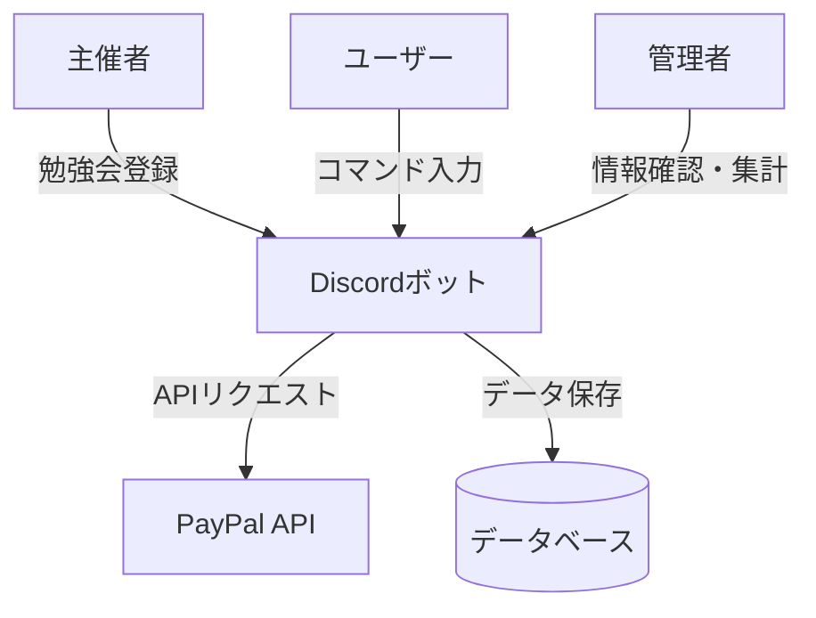
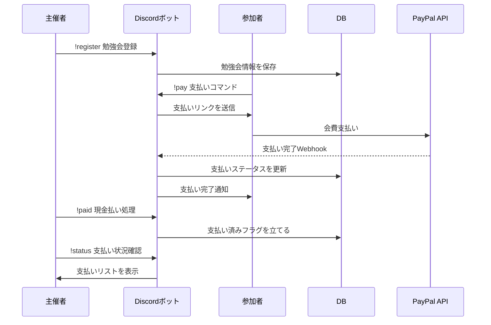

### プロジェクト概要
Discordボットを用いて、勉強会参加者から会費を集め、管理するシステムを作成する。

---

### アーキテクチャ概要

---

### 主要な使用言語、依存ライブラリ
- **Python 3.11**
  - discord.py 2.4
  - requests 2.31
  - sqlalchemy 2.0
  - paypalrestsdk 1.14 (PayPal API)  
- **PostgreSQL 15**

---

### ユーザー操作フロー
1. 主催者が「!register」コマンドを入力し、勉強会のタイトル・日付・会費を登録する。
2. 参加者が「!pay」コマンドを入力し、表示された勉強会一覧から支払うものを選択する。
3. 支払いリンクをクリックし、PayPalやクレジットカードで会費を支払う。
4. 現地で現金払いする場合、主催者が「!paid」コマンドで参加者の支払い済みフラグを立てる。
5. 支払いが完了すると、ボットが「支払い完了」の通知をDiscordに投稿する。
6. 支払い状況がデータベースに登録され、管理者が確認できる。
7. 主催者が「!status」コマンドを使い、各勉強会の支払い状況を確認する。

---

### シーケンスチャート

---

### データ管理方法
- 勉強会ごとにユニークIDを生成し、日付やタイトルと関連付けてデータベースに保存する。
- 参加者リストを管理し、支払いステータス（支払い済み／未払い）を記録する。
- 支払いが完了すると、勉強会IDとユーザーIDで支払い状況を紐付けて更新する。
- 支払い状況はリアルタイムで確認でき、管理者がリストを表示できるようにする。
- 現金払いの場合は、主催者がフラグを立てて管理する。

---

### 注意事項
- 決済処理のセキュリティに十分注意すること（Webhookの検証など）。  
- Discord APIのレート制限に対応するため、非同期処理を活用すること。  
- 機密情報（APIキーなど）は環境変数で管理し、Gitに含めないこと。  
- ユーザーの支払いステータスを適切に管理し、不正や重複に対応できるようにすること。  
- エラーハンドリングを徹底し、例外発生時にもデータの整合性を保つこと。  

---

